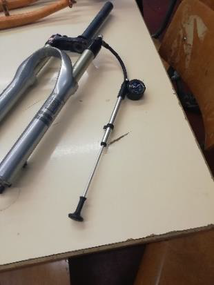

1. ToC
{:toc}

# Onderdelen
{:width="400px"}

# Soorten vering bij voorvorken

## Vaste voorvork

Een **vaste voorvork** heeft geen ingebouwde vering en biedt dus minder rijcomfort. Een **verende voorvork** biedt meer comfort maar betekent ook dat je een beetje verlies van rendement hebt. Fiets je met dezelfde inspanning op een verende voorvork, dan ga je iets minder snel vooruit. Dit komt doordat de veer een deel van de wattage opvangt.

Er zijn voorvorken met een stalen veer en vorken met een luchtvering. Wanneer een voorvork met stalen veer niet meer naar behoren werkt, dan gaan we deze in z’n geheel vervangen. Deze vorken zijn goedkoper dan die met luchtvering.

## Verende voorvork

Een voorvork met luchtvering kunnen we opnieuw afstellen indien nodig. Dit doen we met hulp van een **voorvorkpomp**. Om de vork correct te kunnen afstellen hebben we de informatie van de fabrikant en het gewicht van de fietser nodig.

### Voorvorken met stalen veer
{:width="400px"}

Deze voorvorken zijn voorzien van een stalen veer die de schokken opvangt. Ze zijn meestal goedkoop en wanneer ze niet meer goed veren, worden ze vervangen door een nieuwe veer. Stalen veren zijn ook zwaarder.

### Voorvorken met luchtvering
{:width="400px"}

Deze voorvorken maken gebruik van lucht als veermedium. Ze zijn lichter dan stalen veren en kunnen worden aangepast aan het gewicht van de fietser en de rijstijl. Luchtvering biedt een betere demping en is vaak te vinden op high-end mountainbikes en racefietsen. Bij problemen met de luchtvering kunnen we deze opnieuw afstellen of repareren, afhankelijk van het specifieke probleem. Deze veren worden afgesteld met een vorkpomp.

{:width="200px"}

# Handleidingen

## Voorvork afstellen

1. Het gewicht van de rijder uitoefenen op de vork. 15% a 20% zou moeten worden gecomprimeerd. Sommige vorken hebben hiervoor een ring die als referentie kan gebruikt worden.

    {: .note-title }
    > Sag
    >
    > De __sag__ is de hoeveelheid compressie van de vork onder het gewicht van de rijder.

2. De lucht in de vork afstellen met een voorvorkpomp. De juiste druk is afhankelijk van het gewicht van de rijder en de specificaties van de vork. Raadpleeg de handleiding van de fabrikant voor de aanbevolen drukinstellingen.

    {: style="width: 400px; display: block; margin: 0 auto;"}

    *Op de meeste voorvorken staat een tabel met de juiste instellingen voor elk gewicht.*
    {:.image-caption}

3. Stel de rebound nu zo licht mogelijk af en laat de vork inveren door op de vork te gaan hangen. Bovenop, maar meestal onderaan de (rechter) vorkpoot zit een draaiknop voor de rebound demping.

    Haal de druk van de vork af door snel het stuur (bijna) los te laten. De vork zal nu snel weer terugveren. De meest ideale stand voor dit terugveren is dat de voorvork zo snel mogelijk terugveert, zonder dat het voorwiel van de grond afkomt. Draai de rebound steeds iets vaster en herhaal de handeling.

    Pas als je voorwiel niet meer loskomt van de grond staat je voorvork goed afgesteld.

    {: .note-title }
    > Rebound
    >
    > De __rebound__ is de snelheid waarmee de vork terugveert na compressie. Hoe vaster je de demping instelt, des te langzamer de vork terugkomt in zijn oorspronkelijke stand. Hoe lichter hoe sneller. Te snel en hij werkt als een soort pogostick, te langzaam en hij is nog niet klaar om de volgende oneffenheid te verwerken.